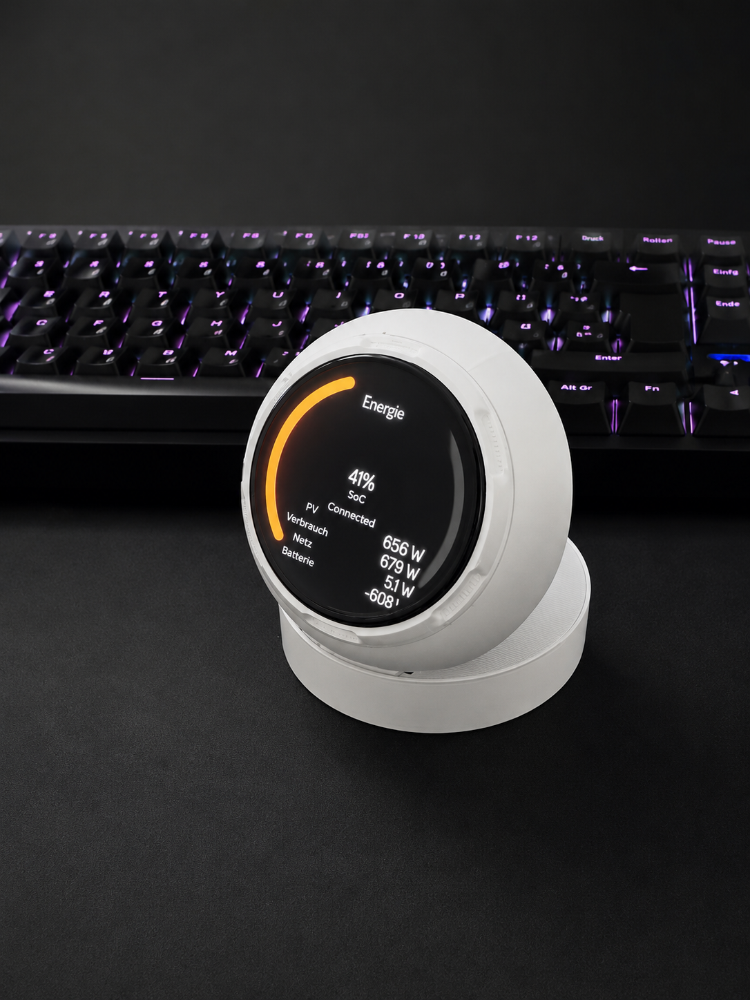
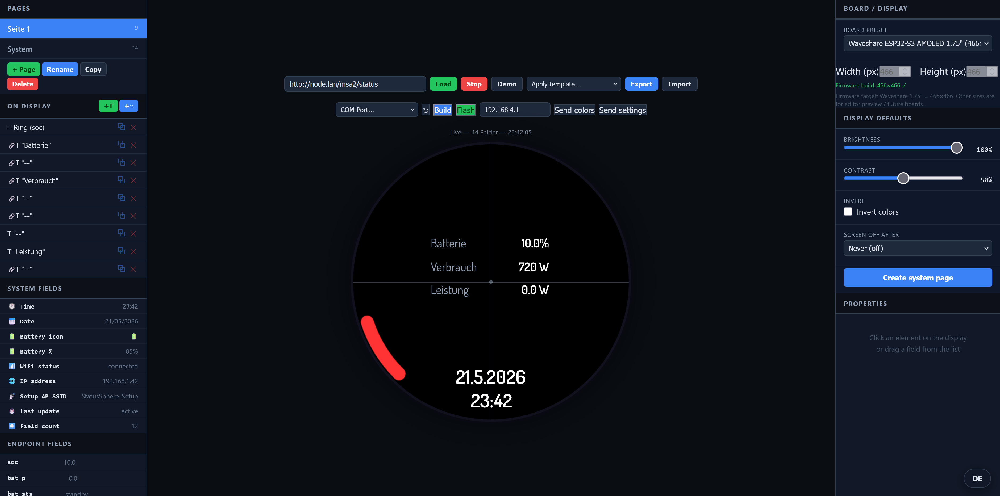

# Status Sphere

Round **ESP32-S3 AMOLED** status display driven by a **JSON HTTP endpoint** (energy, battery, grid, sensors, etc.). Includes a **visual web editor**, Python build/flash server, and on-device WiFi setup portal.

Repository: [github.com/value1338/status-sphere](https://github.com/value1338/status-sphere)

## Preview

| Device (3D-printed case) | Web layout editor |
|--------------------------|-------------------|
|  |  |

*Left: standalone build with round display showing live energy data. Right: browser editor with board presets, snap guides, and build/flash.*

---

## Table of contents

1. [Features](#features)
2. [Hardware](#hardware)
3. [3D-printed case (MakerWorld)](#3d-printed-case-makerworld)
4. [Requirements](#requirements)
5. [Install ESP-IDF](#install-esp-idf)
6. [Clone and build](#clone-and-build)
7. [Web editor](#web-editor)
8. [First-time device setup](#first-time-device-setup)
9. [JSON endpoint format](#json-endpoint-format)
10. [Display pages and touch](#display-pages-and-touch)
11. [HTTP API on the device](#http-api-on-the-device)
12. [Project structure](#project-structure)
13. [Troubleshooting](#troubleshooting)

---

## Features

- Live JSON status on a round AMOLED (default **466×466**)
- Multi-page LVGL UI from embedded `layout.json` (designed in the editor)
- Vertical swipe: brightness · System page: brightness, contrast, invert, screen-off, WiFi reset
- Setup AP + portal: `http://192.168.4.1/`
- Editor: drag-and-drop layout, templates, snap-to-center, board/display size presets

---

## Hardware

**Firmware target (shipped BSP in this repo):**

| Board | Resolution | Notes |
|-------|------------|--------|
| [Waveshare ESP32-S3 Touch AMOLED 1.75"](https://www.waveshare.com/esp32-s3-touch-amoled-1.75.htm) | **466×466** | Default; full build/flash support |

**Example round display module (360×360) — editor preset / future BSP:**

| Source | Resolution | Link |
|--------|------------|------|
| ESP32-S3 round AMOLED (AliExpress example) | **360×360** | [AliExpress listing](https://de.aliexpress.com/item/1005011620888604.html) |

In the editor, choose **Board / Display → Round AMOLED ~1.5" (360×360)** to design for that size. Firmware in this repository is currently built for **466×466** Waveshare only.

| Editor preset | Resolution |
|---------------|------------|
| Waveshare 1.75" | **466×466** |
| Round AMOLED ~1.5" | **360×360** |
| Custom | 120–800 px (square) |

The editor stores `display.width`, `display.height`, and `display.boardId` in `layout.json`. Firmware reads these for layout geometry when embedded; the **physical panel driver** must match your hardware.

---

## 3D-printed case (MakerWorld)

Standalone enclosure inspired by the PrintSphere / Bambu status display form factor (fits **1.75"** round module):

- **MakerWorld model:** [PrintSphere – Bambu Status Display Standalone 1.75](https://makerworld.com/de/models/2517189-printsphere-bambu-status-display-standalone-1-75?from=search#profileId-2768838)

The photo above (`docs/print.png`) shows this case with a Status Sphere UI on the round display.

---

## Requirements

| Component | Version |
|-----------|---------|
| Python | 3.9+ |
| Git | 2.x |
| USB driver | CP2102 / CH340 (common on Waveshare boards) |
| **ESP-IDF** | **v6.0.x** (manual install — **not** installed by the editor server) |

---

## Install ESP-IDF

**Windows (recommended):**

Download: https://dl.espressif.com/dl/idf-installer/esp-idf-tools-setup-online-6.0.1.exe

**Manual:**

```bash
git clone -b v6.0.1 --recursive https://github.com/espressif/esp-idf.git
cd esp-idf
# Windows: .\install.ps1 esp32s3
# Linux/macOS: ./install.sh esp32s3
```

Verify:

```bash
idf.py --version
# ESP-IDF v6.0.1
```

> Required before **Build & Flash** in the editor or `idf.py` on the command line.

---

## Clone and build

```bash
git clone https://github.com/value1338/status-sphere.git
cd status-sphere
idf.py set-target esp32s3
idf.py build
idf.py -p COM5 flash monitor
```

After renaming from `MSA2Sphere-main`, use the new folder name in `cd`.

---

## Web editor

### What the server installs automatically

| Component | On server start? |
|-----------|------------------|
| Python venv + Flask/esptool | Yes (`tools/start_editor.bat`) |
| **ESP-IDF** | **No** — install separately |

Check IDF: http://127.0.0.1:5000/api/idf-status → `"found": true`

### Start

**Windows:**

```bat
tools\start_editor.bat
```

**Manual:**

```bash
cd tools/editor
python -m venv .venv
# activate venv, then:
pip install -r requirements.txt
python server.py
```

Open: **http://127.0.0.1:5000**

### Board / display size (editor)

Right sidebar → **Board / Display**:

- Presets: Waveshare 1.75" (466×466), 360×360, custom
- Crosshair at display center; snap while dragging; **⊕ Mitte** in element properties
- Saved in `layout.json` under `"display": { "width", "height", "boardId", "boardLabel" }`

Green **Firmware build** hint when size is 466×466.

### Build & Flash from the editor

1. ESP-IDF installed
2. `tools\start_editor.bat`
3. Board preset = **466×466** for current firmware
4. Select COM port → **Build** → **Flash**

Optional IDF path: `tools/editor/idf_path.txt` (one line, see `idf_path.txt.example`).

---

## First-time device setup

1. Flash firmware (USB)
2. Connect to WiFi AP: **`StatusSphere-Setup`** / password **`12345678`**
3. Open **http://192.168.4.1/**
4. Enter home WiFi + status JSON URL (e.g. `http://node.lan/msa2/status`)

### Reset WiFi

System page → tap WiFi → confirm → credentials cleared, setup AP returns.

---

## JSON endpoint format

Example: `http://node.lan/msa2/status`

```json
{
  "soc":        {"value": 73,      "desc": "State of charge (%)"},
  "bat_p":      {"value": -849.3,  "desc": "Battery power (W)"},
  "sys_pv_p":   {"value": 443.6,   "desc": "PV power (W)"},
  "sys_load_p": {"value": 1403.1,  "desc": "Load (W)"},
  "sys_grid_p": {"value": 110.2,   "desc": "Grid power (W)"}
}
```

Each field: `value` (number/string/boolean/null) and optional `desc`.

---

## Display pages and touch

- Horizontal swipe: change pages
- Vertical swipe: brightness (synced to system page, saved on release)
- System page taps: brightness, contrast, invert, screen-off timer, WiFi reset

---

## HTTP API on the device

| Method | Path | Description |
|--------|------|-------------|
| GET | `/` | Setup portal |
| GET | `/api/health` | Status + raw JSON |
| GET/POST | `/api/config` | WiFi + status URL |
| GET | `/api/wifi/scan` | Scan networks |
| POST | `/api/arc-colors` | Ring colors |
| GET/POST | `/api/display-settings` | Brightness, contrast, invert, screen-off |

---

## Project structure

```
status-sphere/
├── docs/
│   ├── print.png              # device photo (README)
│   └── editor.png             # web editor screenshot (README)
├── main/
│   ├── resources/layout.json  # UI from editor (incl. display size)
│   └── src/                   # application, UI, layout renderer
├── tools/
│   ├── editor/server.py       # Flask: proxy, build, flash
│   ├── simulator/index.html   # Layout editor
│   └── start_editor.bat
└── components/                # Waveshare 1.75" BSP (466×466)
```

---

## Troubleshooting

| Issue | Fix |
|-------|-----|
| Editor: ESP-IDF not found | Install IDF; set `tools/editor/idf_path.txt` or check `/api/idf-status` |
| After folder rename, build fails | `idf.py fullclean` then `idf.py build` |
| Layout looks wrong on device | Editor board preset must be **466×466** for current hardware |
| 360×360 preset | Editor preview only until a matching BSP is added |
| CORS in editor | Run via `server.py`, not `file://` |

---

## License

See repository license file when published.
